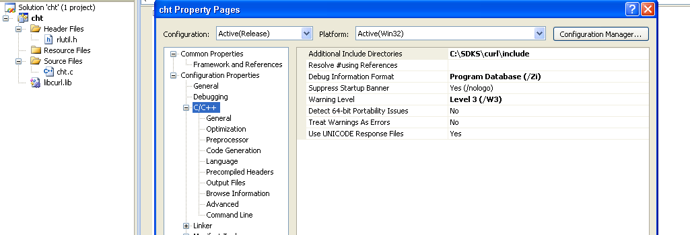
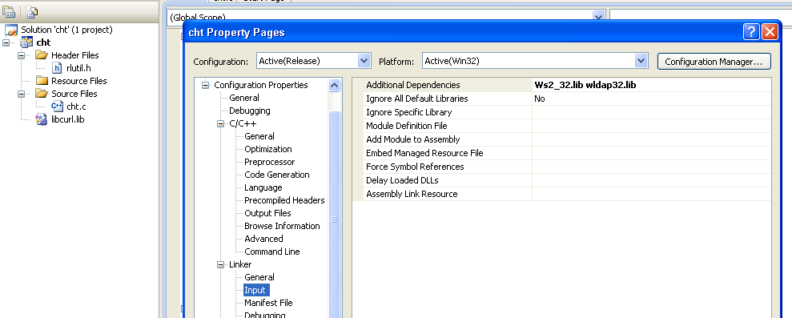
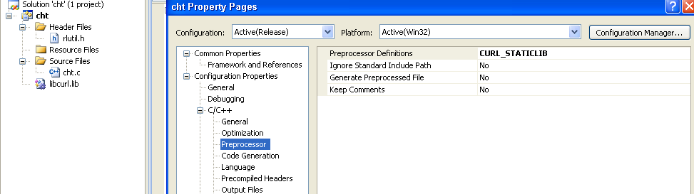

# Compiling CHT.exe
Prerequisites for build environment (mine is VM with Windown XP guest)
* Clone repository or download src from it first
* Visual Studio express (v. 2008 is just fine which works on XP)
* [CMake](https://cmake.org/download/)
* [curl](https://curl.haxx.se/download.html)

# 1. Preparation 
1. Install studio (to C:\SDKS\v9.1)
1. Install cmake (to C:\SDKS\cmake)
1. Extract curl (to C:\SDKS\curl)
1. Compile curl with cmake
    1. extract archive, rename directory 
    1. set all environment variables for VS by running
     `C:\SDKS\v9.1\VC\vcvarsall.bat` in command prompt
    1. change dir to C:\SDKS\curl
    1. Continue with variants bellow 2a or 2b

# 2a. With CMake (for release)
    C:\SDKS\curl>cmake -DCURL_STATICLIB=ON -DBUILD_SHARED_LIBS=OFF -DCMAKE_BUILD_TYPE=MinSizeRel -G "NMake Makefiles"
    C:\SDKS\curl>nmake libcurl

# 2b. With VS
1. C:\SDKS\curl>cmake -DCURL_STATICLIB=ON -DBUILD_SHARED_LIBS=OFF -G "Visual Studio 9 2008" .
1. (C:\SDKS\curl>cmake -DCURL_STATICLIB=ON -DBUILD_SHARED_LIBS=OFF -G "Visual Studio 10 2010" .)
1. Open ALL_BUILD.vcxproj in Visual Studio
1. Right click on project "libcurl" and select "Set as StartUp Project"
1. From Build type select MinSizeRel
1. Build libcurl from menu "Build"
1. In output you should find Build: # succeeded string and above that location of lib to remember: `C:\SDKS\curl\lib\MinSizeRel\libcurl.lib`

# 3a. CHT Project with CMake
    C:\SDKS\cht\build>cmake -DCMAKE_BUILD_TYPE=Release -G "Visual Studio 9 2008" ..\cht\src
2. Open CHT.sln in VS
3. Right click on project "cht" and select "Set as StartUp Project"
4. From Build type select Release
5. Build it

# 3b. CHT Project from scratch
1. Create empty console app in VS
1. Add files cht.c and rlutil.h. Add additioal directory include `C:\SDKS\curl\include` by right rigth clicking on project, Properties. Both showned on picture.

1. Linking will failt if you build project now. You should setup linker with both: Additional Dependencies: "ws2_32.lib wldap32.lib"

1. and Preprocessor Definitions set: "CURL_STATICLIB"

If error about LIBCMT.lib appears, change Project + Properties, C/C++, Code Generation, Runtime Library. Set as "/MT". **But this only show problem with step 2a, use step 2b instead**. Better to leave it /MD. Amd give more RAM to VM.