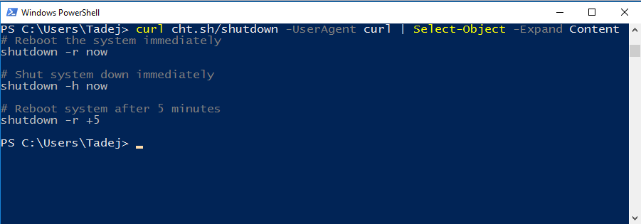

# Motivation developing cht binary client

Great online tool available http://cheat.sh deserves to have better client ulility for accessing from M$ windows platform.
Although I am not its everyday user I believe that this tool will make me more connected and committed to its "service".

## Different behaviour as expected

If we search for help on builtin curl powershell command on M$ systems 
```
help curl
```
NAME
    Invoke-WebRequest ...

ALIASES
    iwr
    wget
    curl

We can see there is curl only alias for iwr which behave _totally_ different. I do not see it very user friendly since you have lot more typing for the same result as `wget -qO- cht.sh/mv` or `curl cht.sh/mv`. You have to write something as long as:

```
curl cht.sh/shutdown -UserAgent curl | Select-Object -Expand Content
```


Other disadvantages:
- This app need to be run in powershell (which is show) not in command prompt, otherwise you have to handle coloring highlihting
- Not have more control of use in hands